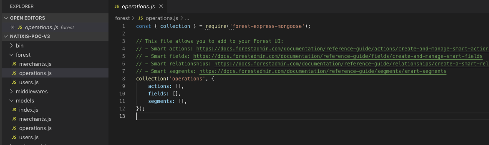
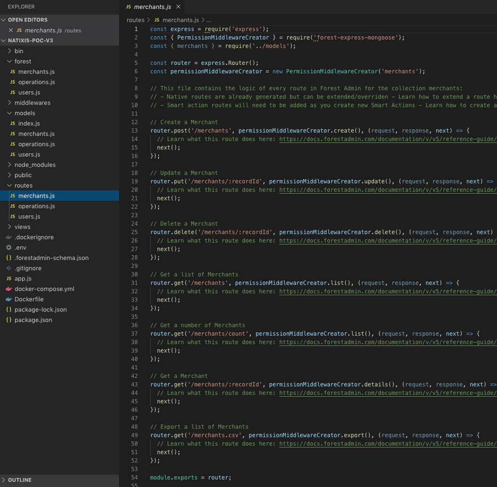
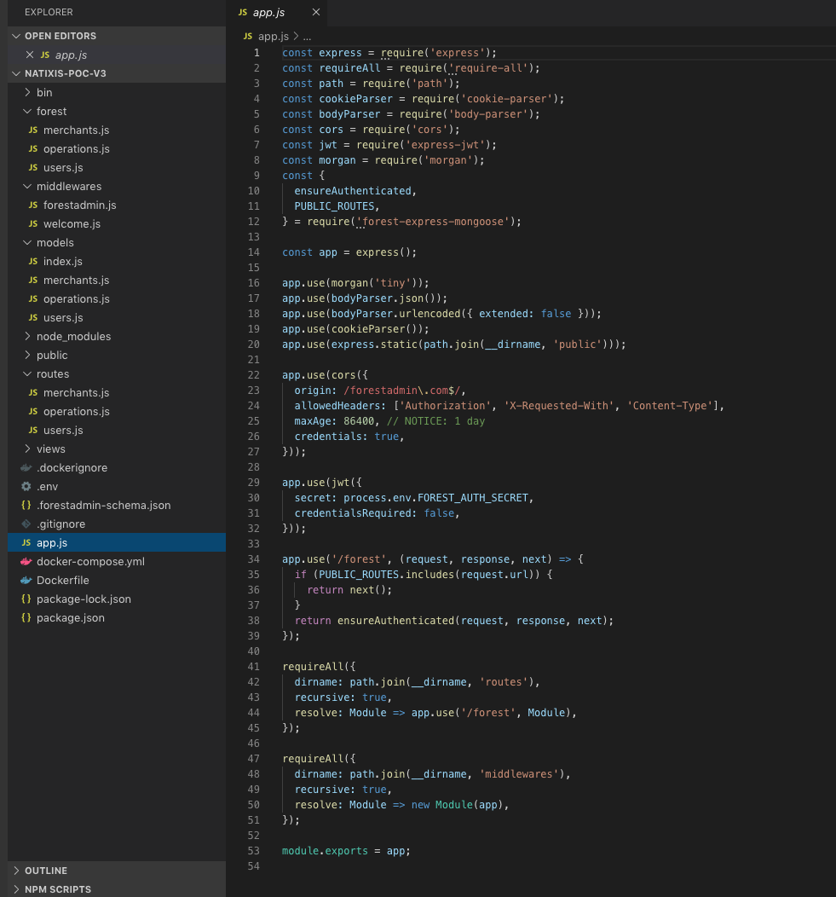

# Changes from lumber v2 to v3

## Regarding the architecture of the project generated

### Forest folder \(to declare smart fields, smart actions and smart segments\)

The new Lumber includes from the get go the folder Forest itself including a file for each of the models detected. So you do not need to add it manually.

In addition, you get a skeleton in which to plug your smart fields, actions and segments directly.



### Routes folder

The routes folder includes already a file for each of your models. A middleware for each native route is already declared so you can add whatever logic you need inside.



### App.js file

The `app.js` file now includes the `ensureAuthenticated` logic so you do not need to add it every time you add a smart action.

`Cors` and the path to the routes middlewares for each model are also included directly so you do not need to add it as you did in lumber v2.



## Regarding smart actions

Where smart actions logic used to be declared in your `routes/your_model.js` file like this in Lumber v2 :

```text
router.post('/actions/invite-user', Liana.ensureAuthenticated,(req, res) => {
```

You can declare them like this with Lumber v3:

```text
router.post('/actions/invite-user',(req, res) => {
```

## New syntax to require models

We use now

```text
const {orders} = require('../models');
```

Which allows to require directly the model needed. Before we required

```text
const models = require('../models');
```

And called when needed for each model

```text
models.orders.findOne...
models.items.findOne...
```

So don't forget to replace the first syntax with the old one if you want to re-use old code.

